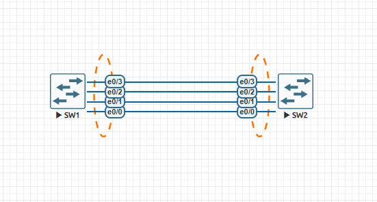

# ETHERCHANNEL (LACP & PAgP) 

## Purpose 
The purpose of this lab is to explore the concept of an EtherChannel; bundling multiple physical links into one logical link. We’ll also look into understanding negotiation modes, preventing misconfigurations, as well as load-balancing behavior. 

## Topology 


## Requirements 
In this lab, we shall create two EtherChannels, one using LACP and another using PAgP. 

### Part A - LACP EtherChannel 
1. Bundle Eth0/1-Eth0/4 between SW1 and SW2 
2. Use LACP active mode 
3. Make the Port-Channel a trunk 
4. Allow VLANs 10, 20, and 30 on the trunk 
5. Verify load balancing 

### Part B - PAgP EtherChannel 
1. Use PAgP desirable mode 
2. Keep trunking as is 
3. Verify negotiation behavior 

### Part C - Break the Lab 
1. Make either side LACP while the other is on PAgp and observe 

##Tasks 
###Part A 
1. Prepare interfaces on both switches for the EtherChannel. Ensure that all interfaces 
match speed, duplex (show interfaces status), trunk mode as well as allowed VLANs 

#### SW1
```
SW1(config)#int range ethernet 0/0-3 
SW1(config-if-range)#switchport trunk encapsulation dot1q 
SW1(config-if-range)#switchport mode trunk 
SW1(config-if-range)#switchport trunk allowed vlan 10,20,30
```
#### SW2 
```
SW2(config)#int range ethernet 0/0-3 
SW2(config-if-range)#switchport trunk encapsulation dot1q 
SW2(config-if-range)#switchport mode trunk 
SW2(config-if-range)#switchport trunk allowed vlan 10,20,30 
SW2(config-if-range)#end
```
2. Create a Port-Channel with LACP on both switches 
#### SW1
```
SW1(config-if-range)#channel-group 1 mode active
```
#### SW2
```
SW1(config-if-range)#channel-group 1 mode active
```

### Part B 
1. Remove existing EtherChannel on SW1 and recreate using the PAgP protocol 

```
SW1(config)#no interface port-channel 1 
SW1(config)#interface range ethernet 0/0-3 
SW1(config-if-range)#channel-group 1 mode desirable 
SW1(config-if-range)#no shut
``` 
Since only one side of the EtherChannel is configured using PAgP and the other is still  configured using LACP, we can go ahead and observe what this does to the channel. Once that is tested, we can go ahead and configure PAgP on SW2. 
```
SW2(config)#no interface port-channel 1 
SW2(config)#interface range ethernet 0/0-3 
SW2(config-if-range)#channel-group 1 mode desirable 
SW2(config-if-range)#no shut
``` 

### Part C 
We have already seen what happens when one side of the EtherChannel is configured with LACP while the other uses PAgP.  

## Conclusion 
In this lab, we learned how to configure an EtherChannel, using both LACP as well as PAgP. LACP (Link Aggregation Control Protocol) is an IEEE Standard protocol and is multi-vendor whereas PAgP (Port Aggregation Protocol) is a Cisco proprietary protocol. After creating the Etherchannel on both switches, we observed that Port-Channel 1 was given the flags SU, standing for Layer 2 and Up respectively.Eth0/0-3 were also flagged with P, indicating that they are all bundled in an ether channel. This confirms that the EtherChannel was configured correctly. We could also see from Figure 2 that the protocol used was LACP.  

Next we removed the Etherchannel from SW1 and recreated it using the PAgP protocol, and observed what happened. We then noticed that Port-Channel 1 on SW1 was given the flags SD. The Port-Channel was still configured as a L2 channel, however this time it was down, indicating that there would be no traffic flowing through the logical interface. The physical interfaces Eth0/0-3 were also given the flag I, indicating that they are stand-alone interfaces, and not bundled in a port-channel.  

After configuring SW2 with its respective PAgP Ether-Channel, we observed that Port-Channel 1 gets the flags SU again, and the physical interfaces get the flag P, indicating that they are part of an EtherChannel. 

📄 Full write-up: [EtherChannel.pdf](EtherChannel.pdf)
