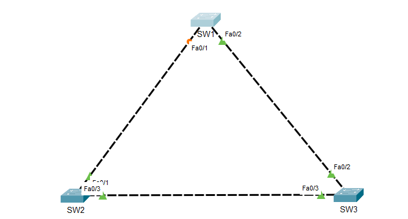

# Spanning Tree Variants

## Purpose
The purpose of this lab is to explore and understand the different variants of the Spanning Tree Protocol (STP), that being STP, RSTP (Rapid Spanning Tree Protocol) & PVST+ (Per-VLAN Spanning Tree Plus). We’ll look into how a switch elects a root bridge, blocks redundant links and how they converge under failure. We’ll also look at the differences across STP, RSTP as well as PVST+ modes.

## Topology


## Requirements
### 1. STP (IEEE 802.1D)
- Enable STP on all switches
- Observe root bridge election
- Identify root ports and designated ports
- Identify which link becomes blocked

### 2. RSTP (IEEE 802.1w)
- Enable RSTP on all switches
- Note differences in convergence
- Trigger a topology change
- Observe faster transitions

### 3. PVST+ (Cisco's proprietary per-VLAN STP)
- Enable PVST on all switches
- Use at least 2 VLANSs (10 & 20)
- Make SW1 root for VLAN 10
- Make SW2 root for VLAN 20
- Observe how blocked ports differ per VLAN

## Tasks
### STP
STP is enabled by default on Cisco switches, so we’ll go ahead and run ```show spanning-tree``` on all three switches.

```
>enable
#show spanning-tree
```

### RSTP
For the second part, we’ll enable RSTP on all three switches.
```
#config t
(config)#spanning-tree mode rapid-pvst
```

From there, we’ll shutdown FastEthernet0/2 then undo the shutdown on SW1, and observe the faster transition based on the topology change.

### PVST
For the last part, we’ll go ahead and enable PVST+ and create VLAN 10 and VLAN 20 on all three switches. All the links should be made trunk links as well, and have both VLAN 10 & 20 allowed on them. We will then make SW1 the root for VLAN 10, and SW2 for VLAN 20

```
(config)#spanning-tree mode pvst
(config)#vlan 10
(config-vlan)#vlan 20
```

#### SW1:
```
SW1(config)#int range fa0/1-2
SW1(config-if-range)#switchport mode trunk
SW1(config-if-range)#switchport trunk allowed vlan 10,20
SW(config-if-range)#exit
SW1(config)#spanning-tree vlan 10 priority 4096
SW1(config)#end
```

#### SW2:
```
SW2(config)#int range fa0/1,fa0/3
SW2(config-if-range)#switchport mode trunk
SW2(config-if-range)#switchport trunk allowed vlan 10,20
SW2(config-if-range)#exit
SW2(config)#spanning-tree vlan 10 priority 4096
SW2(config)#end
```
#### SW3:
```
SW3(config)#int range fa0/1-2
SW3(config-if-range)#switchport mode trunk
SW3(config-if-range)#switchport trunk allowed vlan 10,20
SW3(config-if-range)#end
```

## Conclusion
From figure 4, we observe that SW3 has been elected as the root bridge, and as a result both of its interfaces Fa0/3 and Fa0/2 are designated ports. Since we’re using VLAN1, all 3 switches have the same priority value (32768+1[VLAN ID]. Therefore, SW3 has the lowest MAC address, hence why it was elected as the root bridge (Root bridge = Least value given by [Priority + VLANID + MAC Address]).

We also see that Fa0/2 on SW1 as well as Fa0/3 on SW2 are designated as the root ports. These are the ports on the non-root bridge switches that have the lowest path cost to the root bridge. This leaves Fa0/1 on SW1 and SW2 respectively. The switch port with the lowest bridge ID will then be selected as a designated port as well (lower MAC address since priority and VLAN are the same), which in this case is Fa0/1 on SW2. Therefore Fa0/1 on SW1 will be blocked as per the STP protocol.

For the second part, we enabled RSTP on all 3 switches, shutdown Fa0/2 on SW1, and observed how much quicker Fa0/1 was unblocked to allow packets to flow back to the root bridge, and how quickly it was blocked when the interface was enabled again. 

For the last part, we created VLAN 10 & 20 on the switches and configured the links as trunks, allowing both the VLANs. After configuring the priority values for the VLANs on SW1 & SW2, we could see that SW1 was designated as the root bridge for VLAN 10, and SW2 was designated as the root bridge for VLAN 20. This was due to setting a priority value that is lower than the default value of 32768. SW3 remained the root bridge of VLAN1 as it was before.

📄 Full write-up: [Spanning-Tree-Variants.pdf](Spanning-Tree-Variants.pdf)
