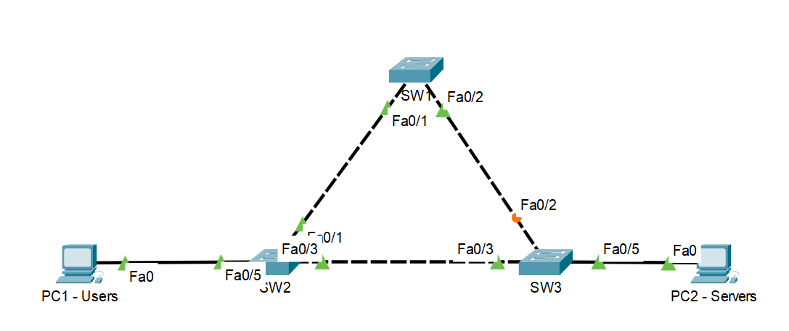

# 1.1 VLAN Creation & Trunking

##Purpose
The purpose of this lab is to go through the fundamentals of VLAN creation, assigning access
and trunk ports, as well as verifying VLAN propagation.

##Topology

##Requirements
- Creating VLANs (10 - Users, 20 - Servers, 30 - Management)
- Configure trunk  links
- Configure access ports
- Configure native VLAN

##Tasks

