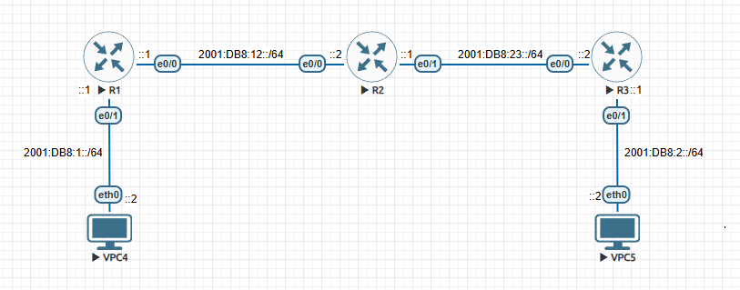

# IPv6 ADDRESSING & STATIC ROUTING 
## Purpose 
The purpose of this lab is to familiarize ourselves with IPv6 structure and notation. We’re going  to look at how we enable IPv6 on Cisco routers as well as how to configure IPv6 static routes.  Let’s get into it. 

## Topology


## Requirements 
1. Enable IPv6 routing and configure IPv6 addresses on the relevant interfaces on all 
routers 
2. Test connectivity between routers and hosts 
3. Configure IPv6 static routes on all routers 
4. Simulate edge routers as in the previous lab (default route)

## Tasks 
First, we’ll have to enable IPv6 routing and configure our IPv6 addresses on all the routers 
### R1 
```
R1(config)#ipv6 unicast-routing 
R1(config)#int e0/0 
R1(config-if)#ipv6 address 2001:DB8:12::1/64 
R1(config-if)#no shut 
R1(config)#int e0/1 
R1(config-if)#ipv6 address 2001:DB8:1::1/64 
R1(config-if)#no shut
```
### R2 
```
R2(config)#ipv6 unicast-routing 
R2(config)#int e0/0 
R2(config-if)#ipv6 address 2001:DB8:12::2/64 
R2(config-if)#no shut 
R2(config-if)#int e0/1 
R2(config-if)#ipv6 address 2001:DB8:23::1/64 
R2(config-if)#no shut
```
### R3 
```
R3(config)#ipv6 unicast-routing 
R3(config)#int e0/0 
R3(config-if)#ipv6 address 2001:DB8:23::2/64 
R3(config-if)#no shut 
R3(config-if)#int e0/1 
R3(config-if)#ipv6 add 2001:DB8:2::1/64 
R3(config-if)#no shut
```
### VPC4 
```
VPCS> ip 2001:DB8:1::2/64 2001:DB8:1::1 
PC1 : 2001:db8:1::2/64
```
### VPC5 
```
VPCS> ip 2001:DB8:2::2/64 
PC1 : 2001:db8:2::2/64
```
Once all interfaces are configured with an IPv6 address, we can test connectivity by pinging our  different interfaces. On Cisco IOS, we ping an IPv6 address by using the command ```ping ipv6 ipv6_address```. 

Next, we need to configure our static routes between our 2 LANs on all 3 of our routers. 

### R1 
```
R1(config)#ipv6 route 2001:db8:2::/64 2001:db8:12::2
```
### R2 
```
R2(config)#ipv6 route 2001:db8:2::/64 2001:db8:23::2 
R2(config)#ipv6 route 2001:db8:1::/64 2001:db8:12::1
```
### R3 
```
R3(config)#ipv6 route 2001:db8:1::/64 2001:db8:23::1
```
To verify that our routes are correct, we’ll ping VPC5 from VPC4. Once that has been verified,  we’ll go ahead and configure default routes on R1 as well as R3. 
### R1 
```
R1(config)#ipv6 route ::/0 2001:db8:12::2
```
### R3 
```
R3(config)#ipv6 route ::/0 2001:db8:23::1
```
We can then use show ipv6 route to verify the default route. Now, we can add a static  address to VPC5’s LAN using a link-local address. 
### R1 
```
R1(config)#ipv6 route 2001:db8:2::/64 e0/0 fe80::2
```

## Conclusion
In this lab, we learned how to configure IPv6 addresses on our router interfaces as well as 
VPCs. We also looked at how to configure static routes using IPv6. Routers do not have IPv6 
routing enabled by default, so the ipv6 unicast-routing command is essential when 
planning to do any IPv6 routing. 

IPv6 is the successor to IPv4, designed primarily to solve address exhaustion, but it also 
improves routing efficiency, auto-configuration as well as security support. An IPv6 address is 
128-bit, therefore the number of possible addresses are  
2<sup>128</sup> =  340,282,366,920,938,463,463,374,607,431,768,211,456 (approx. 340 undecillion)! 
With this address scheme, there is quite literally a limitless supply of addresses for future 
devices.  

IPv6 addresses are written in hexadecimal, and are divided into 8 groups of 16 bits (Hextets). 
Each group is separated by a colon. Here’s an example of an IPv6 address that is similar to 
what was used in this lab: ```2001:0db8:0000:0000:0000:0000:0000:0001``` 
You may be thinking, this address is quite long and the ones in the lab weren’t as long. Yes and 
no. The addresses are still almost the same, the only difference is that they were shortened to 
make it easier to type. IPv6 has certain rules that allow the shortening of addresses. 
 
1. Removing leading zeros 
From the above address, we can remove the leading zeros, and instead of 0db8 and 0001 we 
can just write down db8 and 1 respectively, leaving us with: 
```2001:db8:0000:0000:0000:0000:0000:1```. The address is still quite long though. However, there 
is another rule we can use for shortening addresses. 
 
2. Replacing one continuous block of zeros with :: 
This rule allows us to reduce ```2001:db8:0000:0000:0000:0000:0000:1``` to just ```2001:db8::1```. Much 
better. The only thing with this rule is that you can only use it ONCE per address, otherwise 
devices would get confused as to how many zeros to fill in the different gaps. 
 
IPv6 does not use subnet masks, but rather prefix lengths only. Common prefix lengths include: 
/64   → Standard LAN and most common prefix 
/128 → Used for a single host 
/48   → Used for site allocation (from an ISP) 
 
There are 5 types of IPv6 addresses

|Name|Range|Example|Use Case|
|---|---|---|---|
|Global Unicast (Public)|2000::/3|2001::db8:1:1::1/64|Internet routing and public-facing devices|
|Link-Local| FE80::/10| fe80::1| Automatically created on every IPv6 enabled interface. Used for Neighbor Discovery, Routing protocol adjacencies as well as a default gateway for hosts.|
|Unique Local| FC00::/7 / FD00::/8| FD12:3456:789A::1/64| Private IPv6 addresses. Used for internal-only networks and lab environments. |
|Multicast| FF00::/8| FF02::2| Used for Neighbor Discovery and routing protocols|
|Anycast|Conceptual, not a particular range|N/A|Used for DNS, CDN & Load balancing |

Things to note are that routers use link-local addresses as next-hops, not global addresses. Also IPv6 does not have broadcast addresses like IPv4. The concept of Anycast is using the same IPv6 address for multiple devices, that way, traffic will go to the nearest device with that address.

📄 Full write-up: [IPv6-Addressing_and-Static-Routing.pdf](IPv6-Addressing_and-Static-Routing.pdf)
