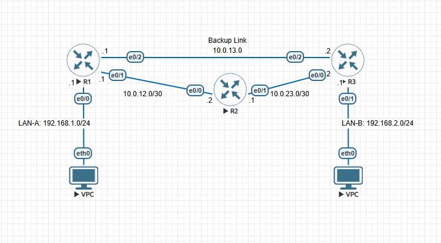

# STATIC ROUTING & FLOATING STATIC ROUTES

## Purpose
In this lab, we dive into Layer 3 concepts, where we’ll tackle basic static routes, multi-hop  routing logic, default routes, as well as floating static routes for backup paths.

## Topology


## Requirements
### Part A - Basic Static Routing 
1. Configure all router interfaces for all 3 routers 
2. Configure PC IP addresses 
3. Add static routes to and from LAN A and LAN B across all 3 routers

### Part B - Default Routes 
1. Simulate an edge router on R1 and R3 by applying default routes 
Part C - Floating Static Routes (Backup Path) 
1. Set up a floating static route utilizing the backup link between R1 and R3 
2. Simulate a link failure on the original path (R1 ←→  R2 ←→  R3) to test backup link. 

## Tasks
### Part A
First we configure the interfaces on each of the routers
#### R1
```
R1(config)#int e0/0 
R1(config-if)#description LAN-A Gateway 
R1(config-if)#ip address 192.168.1.1 255.255.255.0 
R1(config-if)#no shut 
R1(config-if)#int e0/1 
R1(config-if)#description Link to R2 
R1(config-if)#ip address 10.0.12.1 255.255.255.252 
R1(config-if)#no shut 
R1(config-if)#int e0/2 
R1(config-if)#description Backup Link to R3 
R1(config-if)#ip address 10.0.13.1 255.255.255.252
```

#### R2
```
R2(config)#interface e0/0 
R2(config-if)#description Link to R1 
R2(config-if)#ip address 10.0.12.2 255.255.255.252 
R2(config-if)#no shutdown 
R2(config-if)#int e0/1 
R2(config-if)#description Link to R3 
R2(config-if)#ip address 10.0.23.1 255.255.255.252 
R2(config-if)#no shut
```

#### R3
```
R3(config)#interface e0/0 
R3(config-if)#description Link to R2 
R3(config-if)#ip add 10.0.23.2 255.255.255.252 
R3(config-if)#no shut 
R3(config)#int eth0/1 
R3(config-if)#description LAN-B Gateway 
R3(config-if)#ip address 192.168.2.1 255.255.255.0 
R3(config-if)#no shut 
R3(config-if)#int eth0/2 
R3(config-if)#description Backup Link to R1 
R3(config-if)#ip address 10.0.13.2 255.255.255.252 
R3(config-if)#end
```

Once that is done, we then give our PCs IP addresses 

#### VPC - A
```
VPCS> ip 192.168.1.2/24 192.168.1.1 
Checking for duplicate address... 
VPCS : 192.168.1.2 255.255.255.0 gateway 192.168.1.1
```

#### VPC - B
```
VPCS> ip 192.168.2.2/24 192.168.2.1 
Checking for duplicate address... 
VPCS : 192.168.2.2 255.255.255.0 gateway 192.168.2.1
```

Then we can go ahead and add our static routes on the routers between LAN-A and LAN-B

#### R1
```
R1(config)#ip route 192.168.2.0 255.255.255.0 10.0.12.2
```

#### R2
```
R2(config)#ip route 192.168.2.0 255.255.255.0 10.0.23.2 
R2(config)#ip route 192.168.1.0 255.255.255.0 10.0.12.1
```
#### R3 
```
R1(config)#ip route 192.168.2.0 255.255.255.0 10.0.12.2
```
Once the routes have been added, we can try to ping PC-B from PC-A. 

### Part B - Default routes 
Now for part B, we’ll simulate “edge” routers on R1 and R3 by using default routes.  
#### R1 
```
R1(config)#ip route 0.0.0.0 0.0.0.0 10.0.12.2
```
#### R3 
```
R3(config)#ip route 0.0.0.0 0.0.0.0 10.0.23.1
```
### Part C - Floating Static Routes (Backup Path)  
Now we’ll add additional routes on R1 and R3 as a backup in case of link failure between R1,  R2 and R3. 
#### R1 
```
R1(config)#ip route 192.168.2.0 255.255.255.0 10.0.13.2 200 
R1(config)#int eth0/2 
R1(config-if)#no shut
``` 
#### R3
```
R3(config)#ip route 192.168.1.0 255.255.255.0 10.0.13.1 200 
R3(config)#int eth 0/2 
R3(config-if)#no shut
``` 
To simulate a link failure, we’ll shut down Eth0/0 on R3, and Eth0/1 on R1 
#### R3 
```
R3(config)#int eth0/0 
R3(config-if)#shut
``` 
#### R1
```
R1(config)#int eth 0/1 
R1(config-if)#shut
```

## Conclusion
In this lab, we went through the basics of static routing. When using static routing, we define the destination address with its subnet mask, as well as the next hop to that address from the router. We also observed the use of a default route. The default route acts as a “catch all” route, meaning all addresses that are not defined on the routing table will be sent to the next hop defined on the default route. Remember that when a router receives a packet to be routed, it checks against all the entries in the routing table for one with the highest prefix match. If none is found it’ll send the packet via the default route, also known as the gateway of last resort. 

We also learned about the concept of floating routes. Floating routes are typically used as a backup in case of link failures. In order to set a floating static route, we need to configure our static route with an administrative distance that is higher than 1 (1 is the default administrative distance of a static route). After the highest prefix match, the router will prioritize the route with the lowest administrative distance. Therefore, by setting our administrative distance to 200 for the same route, the router will prioritize the route with the AD of 1 instead of 200. Also note that when both the routes are configured, only the active route (AD = 1) will be displayed on the routing table. When we simulate a link failure on the original path, the floating route takes precedence as the original route is no longer valid / next hop is no longer reachable. We also observed the paths the packets took before and after the link failure between LAN-A and LAN-B using traceroutes.

📄 Full write-up: [Static-Routing-and-Floating-Static-Routes.pdf](Static-Routing-and-Floating-Static-Routes.pdf)
